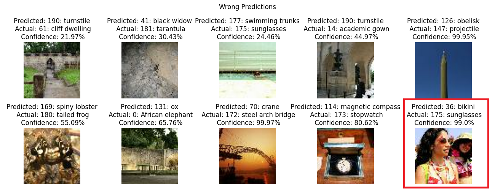

# Convolutional Neural Networks - Image Classification

This repository chronicles my journey into exploring the powerful capabilities of TensorFlow/Keras for convolutional neural networks (CNNs). It serves as a practical implementation hub for building and experimenting with CNN architectures across a variety of datasets, showcasing their application in image classification tasks.

## About the Project

## Image Classification

This repository includes implementations of CNN architectures for a variety of datasets, including:
- MNIST
- CIFAR-10
- CIFAR-100
- Tiny-ImageNet

---

## Getting Started

### Prerequisites

For GPU support on Windows, I recommend using [Anaconda](https://www.anaconda.com/) and installing TensorFlow version 2.10.1.  

### Installation

1. Clone the repository:
   ```bash
   git clone https://github.com/danieltar18/linear-algebra.git

2. Install the required dependencies:
   ```
   Windows: pip install tensorflow==2.10.1
   Ubuntu: pip install tensorflow==2.17.0 
   ```
3. Launch Jupyter Notebook or VS code (Fine-tuning were made on Kaggle Notebooks)

## Project Highlights

### MNIST

The MNIST dataset, a classic benchmark for image recognition tasks, was used to train a shallow CNN model (only one CNN layer with 8 kernel), that was built from scratch using low-level Keras/TensorFlow.

**Model Performance:**
- Accuracy (Stratified KFold, 5 splits): **97.4%**

**A Sample Image after second CNN layer filters Visualization:**

`Depth Slice` means: Applying the n-th filter on the image

<p align="center">
  
</p>


Dataset source: [Yann LeCun's MNIST Database](http://yann.lecun.com/exdb/mnist/)

---

### CIFAR-10

For the CIFAR-10 dataset, I explored TensorFlow's capabilities for handling image data, following the best practices outlined in [this tutorial](https://www.tensorflow.org/tutorials/load_data/images). I built a shallow Convolutional Neural Network with 6 Conv2D Layer, BatchNormalization and Dropouts.

**Model Performance:**
- Accuracy (Stratified KFold, 5 splits): **86.49%**

**Confusion matrix on a Fold:**

<p align="center">
  
</p>

**Accurate Predictions with Confidence:**


My Kaggle Notebook: [CIFAR-10 with CNN Network](https://www.kaggle.com/code/dnieltar/cifar-10-with-cnn-network)

Dataset source: [Kaggle - CIFAR-10](https://www.kaggle.com/competitions/cifar-10) or [Toronto Edu - CIFAR-10](https://www.cs.toronto.edu/~kriz/cifar.html) 

---

### CIFAR-100

First and foremost, I tried to build a deeper and wider Convolutional Neural Network with BatchNormalization, Dropout and MaxPooling layers. Furthermore, based on some studies/researches I implemented CosineDecay as optimizer with a warmup option. 
To be honest, the model was "thriving" till 65%, val_loss ~1.6, although it platued after all. I am convinced that, It would be beneficial to build a deeper model and follow the ConvNext model(s) architecture. 

It's a well-know fact that fine-tuning a state-of-the-art model could be valuable. Fine-tuning [ConvNextBase](https://www.tensorflow.org/api_docs/python/tf/keras/applications/ConvNeXtBase) model excluding top for 10 epoch and later the last 50 layer was a crucial step in my project. Finally the model reached 70-80% top-1 accuracy.

**Model Performance:**
- Top-1 Accuracy with a deeper Convolutional Network on one Fold: **~65%**
- Top-1 Accuracy with fine-tuned ConvNextBase (Stratified KFold, 3 splits): **~75.31%**
- Top-1 Accuracy with fine-tuned ConvNextBase on Test Set: **~91.04%**

**Grad-CAM Heatmap on a Sample Image - CNN Network with Sequential API:**

<p align="center">
  
</p>

**ConvNextBase model fine-tuning on CIFAR-100**

<p align="center">
  
</p>

**Accurate and Wrong predictions on Test Set - with fine-tuned ConvNextBase**


My Kaggle Notebook: [Fine-Tuning ConvNext for CIFAR-100](https://www.kaggle.com/code/dnieltar/fine-tuning-convnext-for-cifar-100)

Dataset source: [Toronto - Edu](https://www.cs.toronto.edu/%7Ekriz/cifar.html)

---

### Tiny-ImageNet

Tiny ImageNet is a smaller subset of the ImageNet dataset designed for quick prototyping and experimentation. It is widely used in deep learning research and education due to its manageable size and complexity.
I did some research and tried to build a ConvNext Neural network based on the documentations, although I didn't have enough capacity to pretrain a model from scratch. That's why I utilized [ConvNextBase](https://www.tensorflow.org/api_docs/python/tf/keras/applications/ConvNeXtBase) from keras.applications for fine-tuning. 

The fine-tuned model achieved Top-1 Accuracy: **87%** 

**ConvNextBase model fine-tuning on Tiny ImageNet**

<p align="center">
  
</p>

**Accurate and Wrong predictions on Validation Set - with fine-tuned ConvNextBase**




It is important to note that the "misclassified" labels are closely related to the true labels or appears as well in the picture, as illustrated within the red square. Specifically, the fine-tuned model identified bikinis in the image, whereas the true label was sunglasses.

Dataset source: [Stanford - CS231n ZIP](http://cs231n.stanford.edu/tiny-imagenet-200.zip)

---

## Conclusion

Feel free to explore the projects and adapt the code for your own datasets. Contributions and suggestions are welcome!

Next Repository will be RNN-s!:)
